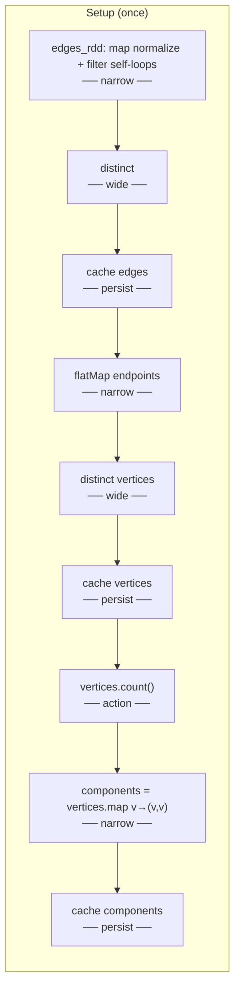
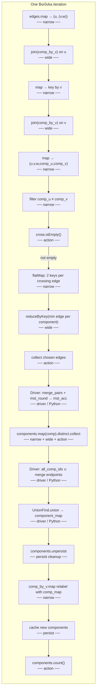

# Borůvka on PySpark: steps and Spark operations

This document explains **what happens** when you run `boruvka_mst` in `src/boruvka_spark.py`: the algorithmic steps, how they map to **RDD operations**, and whether each Spark step is a **narrow transformation**, a **wide transformation**, or an **action**.

For the interactive walkthrough (notebook, Kruskal checks, file output), see `README.md` and `boruvka_mst.ipynb`.

---

## Spark terminology (used in the diagrams)

| Kind | Meaning | Examples in this project |
|------|---------|---------------------------|
| **Narrow transformation** | Each output partition depends only on **one** input partition; **no shuffle**. | `map`, `filter`, `flatMap` |
| **Wide transformation** | Data must be **partitioned by key** across the cluster; involves a **shuffle** (or equivalent exchange). | `join`, `reduceByKey`, `distinct` |
| **Action** | Triggers execution and usually **returns a value to the driver** or writes output. | `count`, `collect`, `isEmpty` |
| **Persistence** | `cache()` / `persist()` mark an RDD to be kept in memory after first compute; **not** an action by itself. | `edges.cache()`, `components.cache()` |

`cache()` is shown in the flow as **persistence** (lazy until an action touches that RDD).

---

## End-to-end pipeline (plain language)

1. **Start Spark** — `SparkSession` / `SparkContext` (outside `boruvka_mst`; see `run_mst.py` or the notebook).
2. **Load edges** — Text or in-memory list → RDD of `(u, v, weight)`.
3. **Normalize** — Undirected edges stored as `(min(u,v), max(u,v), w)`; drop self-loops; `distinct` on the full triple.
4. **Vertices** — Distinct endpoints; **count** vertices (empty graph short-circuit).
5. **Initialize components** — Each vertex `v` is `(v, v)` (“component id = myself”).
6. **Repeat (Borůvka round)** until no crossing edge or iteration cap:
   - Attach **current** component ids to both ends of every edge (**join**).
   - Keep only edges with **different** component ids (**filter**).
   - For each component, pick the **minimum-weight outgoing edge** (**flatMap** + **reduceByKey**).
   - **Collect** those choices to the driver; update MST list; **union–find** merge; **map** new labels onto all vertices.
7. **Finish** — Distinct final component labels (**collect**); dedupe MST edges on the driver; return `BoruvkaResult`.

---

## Flow diagram: setup (runs once before / around the loop)

Operations come from `boruvka_mst` lines 63–75 (see source for exact code).

If `n_vertices == 0`, the function returns immediately (no Borůvka loop).

---

## Flow diagram: one Borůvka iteration

This matches one pass through the `while iters < cap` body (`boruvka_spark.py` lines 83–141). Arrows follow **execution order** in the source.

---

## Sequence within one iteration (matches source order)

| Order | Step | Spark kind | Role |
|:-----:|------|------------|------|
| 1 | `edges.map(...).join(comp_by_v)` | narrow + **wide** | Attach `comp(u)` |
| 2 | `keyed_by_v.join(comp_by_v).map(...)` | **wide** + narrow | Attach `comp(v)` → full row |
| 3 | `filter(comp_u != comp_v)` | narrow | Only crossing edges |
| 4 | `cross.isEmpty()` | **action** | Stop if MSF complete |
| 5 | `flatMap` two keys per edge | narrow | Each component “sees” outgoing edges |
| 6 | `reduceByKey(_min_edge_choice)` | **wide** | Min-weight edge **per component** |
| 7 | `collect()` | **action** | Bring winners to driver |
| 8 | Python: `merge_pairs`, `mst_round`, append `mst_acc` | driver | Record MST edges this round |
| 9 | `components.map(...).distinct().collect()` | narrow + **wide** + **action** | Distinct current component labels (then union with merge endpoints on driver) |
| 10 | `UnionFind` + `component_map` | driver | Merge components into new ids |
| 11 | `comp_by_v.map(...).cache()` | narrow + persist | Relabel every vertex |
| 12 | `components.count()` | **action** | Materialize updated `components` RDD |

---

## After the loop (teardown + result)

| Step | Spark kind | Notes |
|------|------------|--------|
| `components.values().distinct().collect()` | narrow + **wide** + **action** | Final component label set → `num_components` |
| `edges.unpersist`, `vertices.unpersist`, `components.unpersist` | persist cleanup | In `finally` |
| MST dedupe + sort | driver / Python | No Spark |

---

## How this relates to MapReduce intuition

- **Map:** attach labels (`map` + `join` stages effectively map sides of the join).
- **Shuffle / reduce:** `join` and `reduceByKey` redistribute by key (component id or vertex id).
- **Reduce:** `reduceByKey` picks one minimum edge per component key.
- **Driver merge:** union–find replaces a second distributed “connected components” pass for that round; vertex relabeling is a **narrow** `map` over the current `(vertex, comp)` RDD.

---

## File input path (outside the core loop)

`edges_rdd_from_text_file` uses `textFile` (**action** when combined with downstream actions) and `mapPartitions` (**narrow**) to parse lines—see `boruvka_spark.py` and `graph_loader.py`.

---

## References

- Implementation: `src/boruvka_spark.py`
- Union–find (driver, per round): `src/union_find.py`
- Spark RDD guide: [RDD Programming Guide](https://spark.apache.org/docs/latest/rdd-programming-guide.html)
