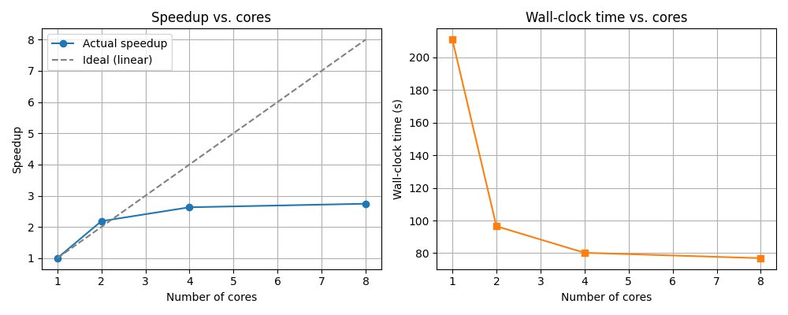
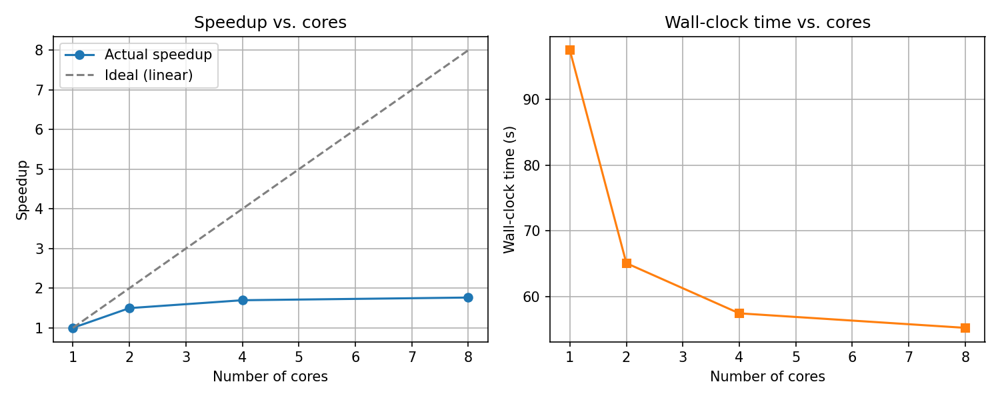

# Amdahl curve
Idea: A program can be divided into two parts: serial, parallizable (can be scaled by increasing the number of cores)

S: Speedup (defined as the ratio of the original time to the optimized time)
- s: serial, p: parallelizable, p: number of cores
- assume original time = 1 for simplicity
$$
\begin{align*} 
S &= \frac{1}{s + \frac{f}{p}} \\
 &= \frac{1}{s + \frac{1-s}{p}}
\end{align*}
$$

Using the speedup curve plotted against the number of processors (very likely to be sub-linear), we can infer the the proportion of serial works by the scaling.

**Source of serial work (driver-side)
- Union Find
- collect()

## Baseline Results
No optimization, experiments conducted against number of cores (still local)

## Optimization: Progressive Edge Pruning

**Main intuition**: drop intra-component edges so later rounds shuffle a progressively smaller working set. Borůvka halves components
each round, so by round 3-4 the majority of edges are useless noise.

**Observations**:
- Siginificant improvement in wall clock time
- Worse scaling against the number of processors (serial work proportion increases under Amdahl fitting)

**Analysis**:
- Pruning reduces the parallel shuffle volume per round, the parallelizable side is optimized
    $$\text{Before: } |E| \times log(V) \\
    \text{After: } |E| \times (1+\frac{1}{2}+\frac{1}{4}+...) \approx 2|E|
    $$
- One more `.collect()` inside the serial work
- Hence, overall proportioin of the serial work increases, yet the resultant wall clock time is largely optimized.
